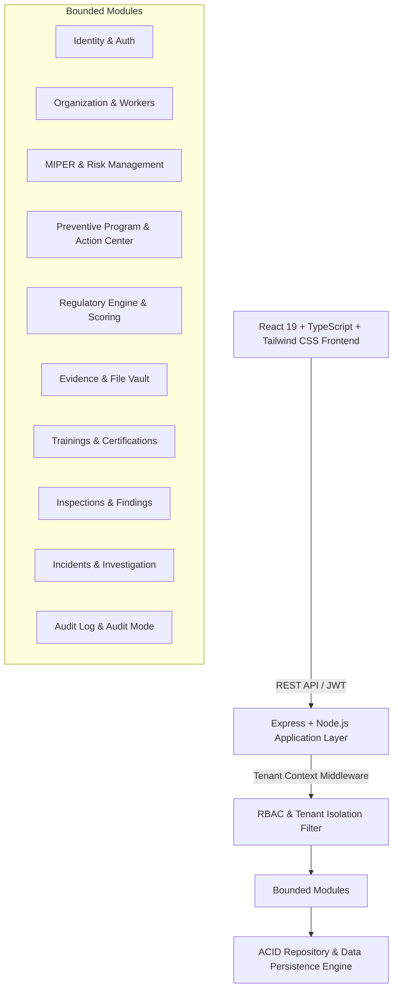

# Arquitectura de DS44 Compliance OS

## 1. Visión General
DS44 Compliance OS está estructurado como un **Monolito Modular** de alto rendimiento con separación limpia de responsabilidades (Clean Architecture pragmática) que asegura aislamiento de tenants, escalabilidad y facilidad de despliegue.

## 2. Decisiones de Arquitectura
1. **Frontend**: React 19 + TypeScript con Vite, Lucide Icons, animaciones suaves con Motion, componentes con diseño de alta densidad informativa, modo claro y oscuro, y generación de PDF en tiempo real con `jspdf` y `jspdf-autotable`.
2. **Backend**: Express + TypeScript con validación de esquemas, middleware de resolución de identidad y tenant isolation seguro, cálculo determinístico de cumplimiento y logging estructurado.
3. **Persistencia & Almacenamiento**:
   - Capa de Repositorio con transaccionalidad, versionamiento inmutable de MIPER y esquemas normativos versionados (`RegulatoryRuleSet`).
   - Abstracción `IFileStorage` para almacenamiento seguro de evidencias con metadatos, tipo MIME, tamaño y cálculo de hash criptográfico.
4. **Exportación & Auditoría**: Generación de paquetes de auditoría comprimidos (.ZIP) mediante `JSZip` conteniendo índice legal, reportes PDF y evidencias foliadas.
