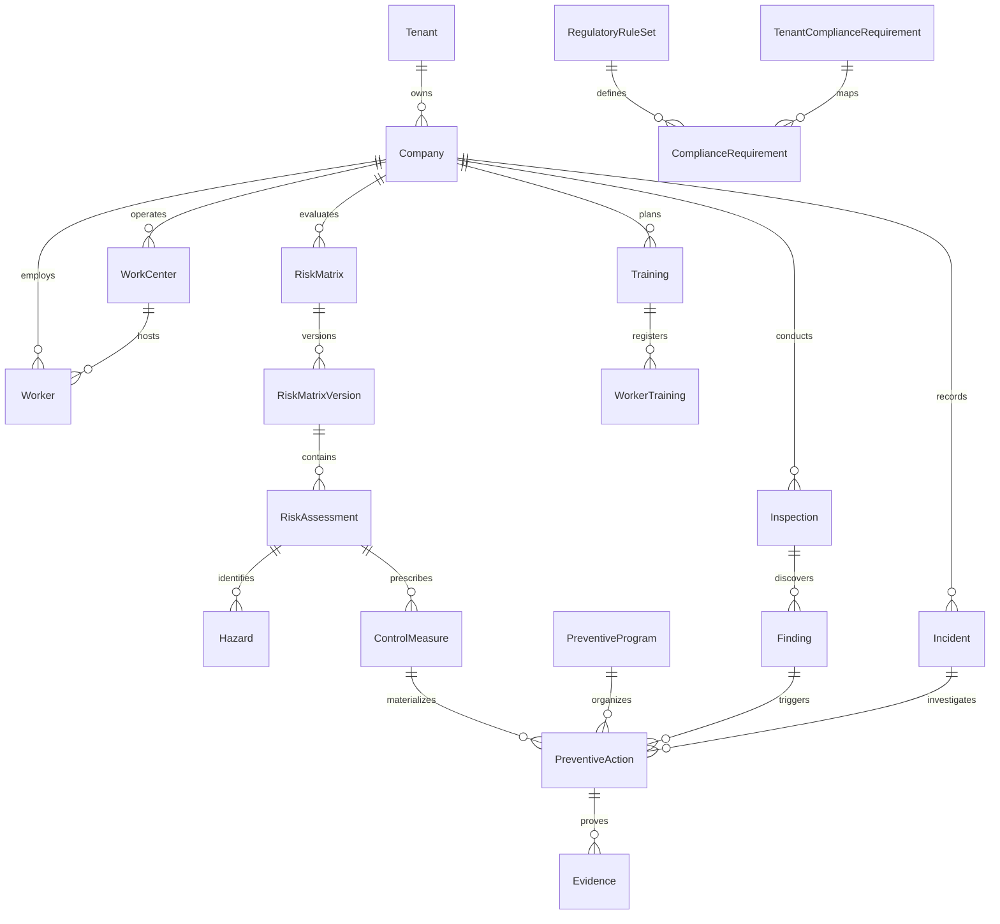

# Modelo de Dominio — DS44 Compliance OS

## 1. Entidades Principales

## 2. Estados de Entidades Críticas
### PreventiveAction
- `Draft`: Borrador inicial en confección de MIPER o inspección.
- `Pending`: Medida aprobada pendiente de inicio.
- `InProgress`: En ejecución por el responsable asignado.
- `Completed`: Marcada como terminada por el ejecutante (requiere evidencia).
- `Verified`: Validada técnicamente por el prevencionista tras revisar evidencia.
- `Rejected`: Evidencia insuficiente o rechazada en verificación.
- `Overdue`: Plazo límite superado sin completarse ni verificarse.
- `Cancelled`: Descartada con justificación registrada.

### TenantComplianceRequirement
- `Compliant`: 100% de los controles y evidencias requeridos están vigentes y verificados.
- `PartiallyCompliant`: Medidas en ejecución con avance comprobable.
- `NonCompliant`: Obligación exigible sin medidas activas o con medidas vencidas.
- `NeedsReview`: Aconteció un trigger de revisión (accidente, cambio de proceso).
- `NotApplicable`: Exenta según dotación o rubro.
